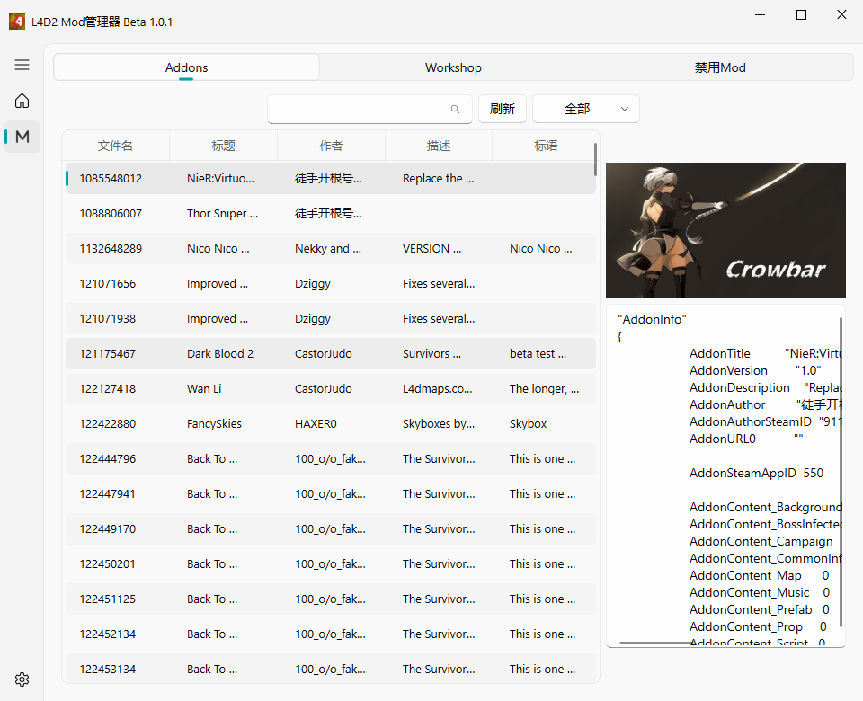

# L4D2 Mod Manager

求生之路2 模组管理器

release中的文件

zip 文件有黑窗口.7z 文件无黑窗口
黑窗口版本有一些调试信息,可以不必理会
关于解压后py文件全部为pyd 是因为打包前cython编译过

### 展示

## 1.0.6
**修复BUG**
1. 最小化后再打开出现的错误

## 1.0.5
**修复BUG**
1. 部分vpk文件解析路径时,解析编码后再次解码失败

**新增功能**
1. 标题列内容可以自定义,右键编辑(不会存到vpk文件中)
2. 检查有无版本更新(可以启动就检查,默认关闭, 请求链接: [update_version.json](https://fdklgbh.github.io/L4D2-Mod-Manager/update_version.json))
3. 设置-清理缓存:清除已删除vpk文件的缓存文件

## 1.0.4
**修复BUG**
1. 1.0.3的兜底把文件找不到一块处理了,暴露出来
2. 内容编码多次解析失败直接强转字符串

## 1.0.3
**修复BUG**
1. 打开vpk文件中出现错误,做一个兜底
2. 出现未处理的错误,弹出的弹窗黑屏问题

## 1.0.2
**优化**
1. 增加特感类别
   被遗漏的 牛牛
2. 增加了生还者类别
   类别名称为其他(需要手动修改类别)

## 1.0.1

**优化**

1. 增加快捷键
    1. 刷新 F5
    2. 搜索 Ctrl+F
2. 列表选中其中一个后,右侧展示信息可拖动隐藏
3. 增加多个文件一起禁用启用
4. 筛选分类或者搜索后,移动文件后,操作后还存在数据,不会复原
5. addonsinfo文件不存在会把文本信息控件隐藏
6. 新增更新日志

**修复问题**

1. vpk文件打开成功,读取vpk文件路径,编码错误
2. 配置禁用目录后,不会自动创建

### 在原有基础上继续编写需要的操作

1. 本地拉源代码继续写,需要先拉[my_qfluent_utils_package](https://github.com/fdklgbh/my_qfluent_utils_package.git)
2. 进入对应python环境以及进入仓库路径执行package.bat