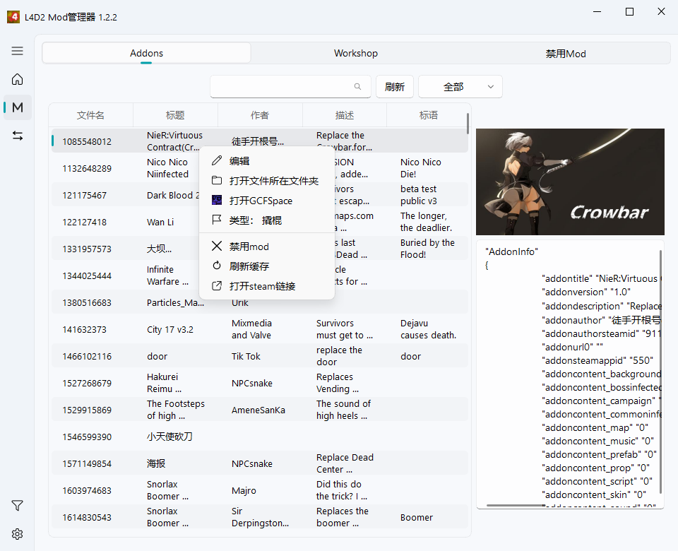
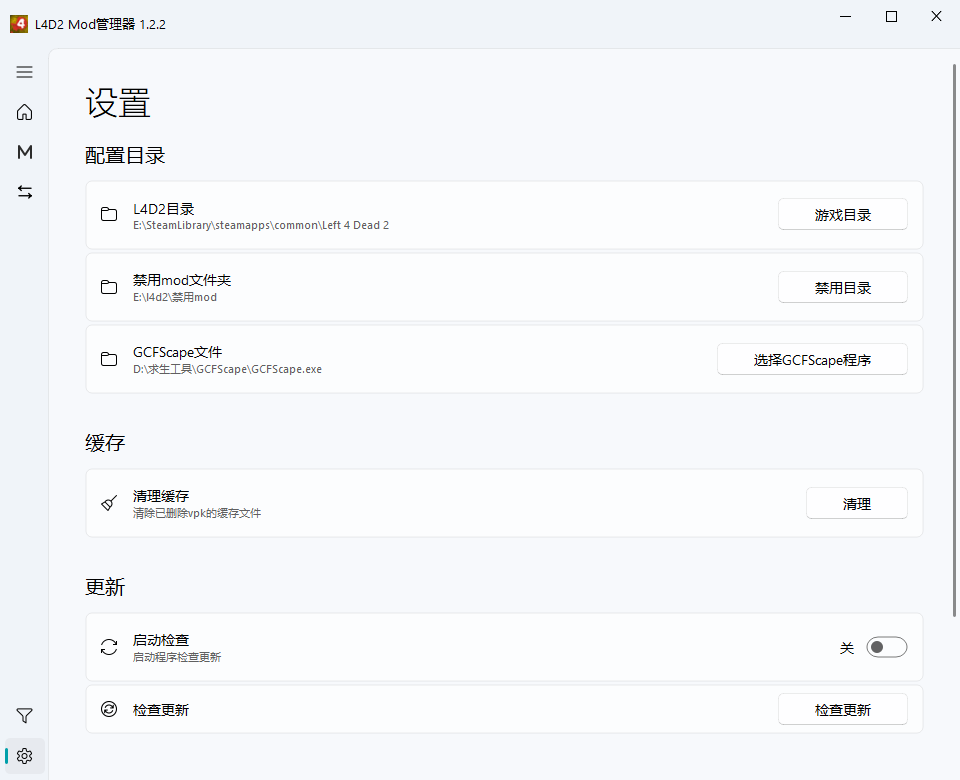

# L4D2 Mod Manager

求生之路2 模组管理器

关于解压后py文件全部为pyd 是因为打包前cython编译过(1.2.2不再编译,编译后发现有问题,nuitka也存在问题)

程序是通过直接移动mod到禁用文件夹打到直接禁用的目的,因此除了需要配置游戏路径,还需要配置一个禁用文件夹

因此,addons中禁用,需要确保游戏中mod列表取消掉了(不然会提示被占用),或者退出游戏再启用禁用

**由于目前修改的时候,感觉代码一坨,后续开始重构,如果没有严重问题,暂时不再出新版本**

### 关于更新

下载解压后,直接复制替换即可 除非release中特意说明

### 部分问题

1. 地图识别不准确

   部分地图拆分为多个part 一部分part没有地图相关信息(
   没有maps/或者missions/开头的文件,且addoninfo中也没有代表地图的字段,或者有但值为0) 就会导致分类识别出现问题
2. 材质

   由于各个mod作者材质定义不一定一样,因此需要手动确认一下

### 展示

## 1.2.2
**已知问题**
1. 第一次打开后配置 GCFspace 路径的时候会报错(qfluentwidgets的mask_dialog_base.py报错,目前无法解决)

**修复bug**
1. 检查更新请求连接失败返回msg导致的报错
2. 切换mod编辑页面
   1. 搜索关键词修改导致显示不出来结果
   2. 搜索内容限制为当前的分类信息
   3. 分类和搜索词关联(切换清除搜索词)
   4. 分类筛选开关和搜索词关联(切换清除搜索词)
   5. 分类筛选同步当前配置的mod
3. 从未使用过配置游戏路径显示文本修改为游戏路径
4. 数据文件不存在报错处理
5. 没有自定义标题的时候,修改标题会直接写入vpk,修改为如果和原本一致就不写入

**优化**
1. 加载mod过程中,页面禁止操作 避免后续判定错误
2. 启用列表的mod,可以配置写入addonlist文件为启用还是禁用
3. mod切换的时候会依据配置的启用禁用写入addonlist.txt(全部则会按照顺序写在最前面),其余分类直接写入到文件最底部
4. 新增切换mod类型的时候,提供加载目前启用的对应分类mod为启用
5. mod页面描述可修改
6. mod切换编辑页面启用栏支持拖拽切换顺序

## 1.2.1

**新增**

1. 一键切换预设mod(不会替换地图, 可以选择全部替换或者替换单个大分类)

   第一次打开加载会比较慢,需要先等待左侧出现"全部-默认"再使用

**优化**

1. 检查更新的请求地址更换,超时时间修改为5秒
2. 缓存切换为数据库(逐渐切换,目前先读取缓存文件写入数据库,后续直接读取数据库,即可不再需要缓存文件)

## 1.1.3

**优化**

1. 标题重命名如果有vpk会写入到mod文件的addoninfo中(游戏目录下没有vpk不受影响)
2. 新增载具大分类

## 1.1.2

**修复bug**

1. 修复文件被占用提示文件不存在错误
2. 修复mod表格中快捷键F2 编辑非标题列内容后报错

## 1.1.1

**优化**

1. 添加遗漏的

## 1.1.0

**新增**

1. 新增日志页面
    1. 后续日志会显示在日志页面中(设置按钮上方)
    2. 日志也会存储到程序根目录下的log文件夹中,日志文件名称为L4d2ModManager.log

       单个文件最大存储日志5mb,文件最多备份4个

**优化**

1. 分类重写,为后续自定义分类准备
    1. 分类后续考虑是通过请求获取分类信息进行更新替换文件还是本地文件配置(大概率是通过请求获取并下载)
2. 选中多个mod右键菜单不再有单个启用/禁用(单个就单个,多个就多个)
3. 多选后,分类文本修改为修改分类(单个选中保持原样)
4. 更换类型的时候,选中多个,会同时更改多个mod(打开选择类型窗口后,没有选中mod类型即为多选)

**修复bug**

1. 连续多个文件不存在重复弹窗问题修复
2. 修复mod页面展示图片后,切换到其他页面后窗口变化再切回mod页面,大小异常问题
3. 无黑窗口版本打开vpk有黑窗口持续展示
4. 无黑窗口版本打开文件所在位置有一闪而过的黑窗口

## 1.0.7

**优化**

1. 更换类型的时候,选中多个,会同时更改多个mod(打开选择类型窗口后,没有选中mod类型即为多选)

## 1.0.6

**修复BUG**

1. 最小化后再打开出现的错误

## 1.0.5

**修复BUG**

1. 部分vpk文件解析路径时,解析编码后再次解码失败

**新增功能**

1. 标题列内容可以自定义,右键编辑(不会存到vpk文件中)
2. 检查有无版本更新(可以启动就检查,默认关闭,
   请求链接: [update_version.json](https://fdklgbh.github.io/L4D2-Mod-Manager/update_version.json))
3. 设置-清理缓存:清除已删除vpk文件的缓存文件

## 1.0.4

**修复BUG**

1. 1.0.3的兜底把文件找不到一块处理了,暴露出来
2. 内容编码多次解析失败直接强转字符串

## 1.0.3

**修复BUG**

1. 打开vpk文件中出现错误,做一个兜底
2. 出现未处理的错误,弹出的弹窗黑屏问题

## 1.0.2

**优化**

1. 增加特感类别
   被遗漏的 牛牛
2. 增加了生还者类别
   类别名称为其他(需要手动修改类别)

## 1.0.1

**优化**

1. 增加快捷键
    1. 刷新 F5
    2. 搜索 Ctrl+F
2. 列表选中其中一个后,右侧展示信息可拖动隐藏
3. 增加多个文件一起禁用启用
4. 筛选分类或者搜索后,移动文件后,操作后还存在数据,不会复原
5. addonsinfo文件不存在会把文本信息控件隐藏
6. 新增更新日志

**修复问题**

1. vpk文件打开成功,读取vpk文件路径,编码错误
2. 配置禁用目录后,不会自动创建

### 在原有基础上继续编写需要的操作

1. 本地拉源代码继续写,需要先拉[my_qfluent_utils_package](https://github.com/fdklgbh/my_qfluent_utils_package.git)
2. 进入对应python环境以及进入仓库路径执行package.bat